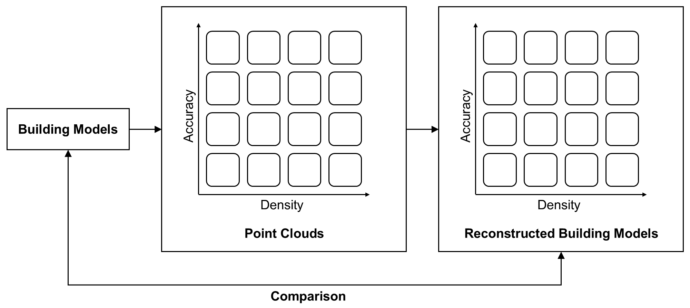
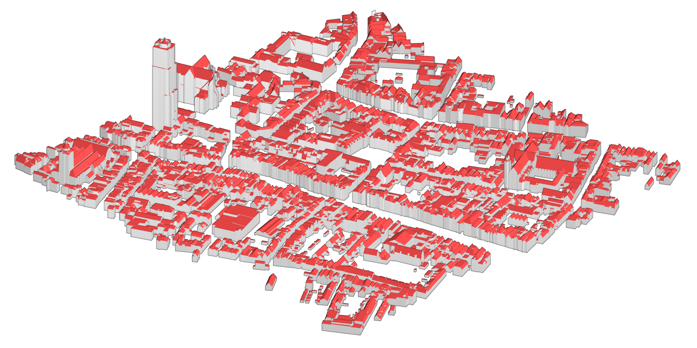
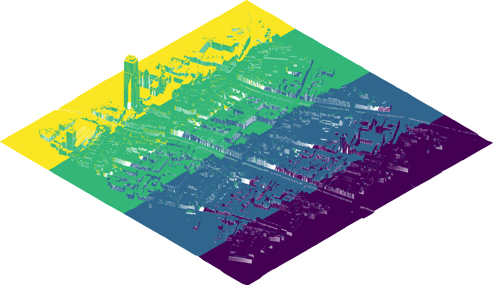
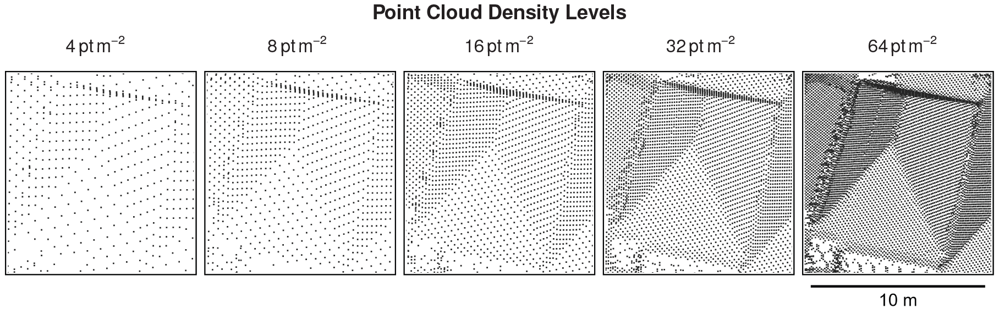
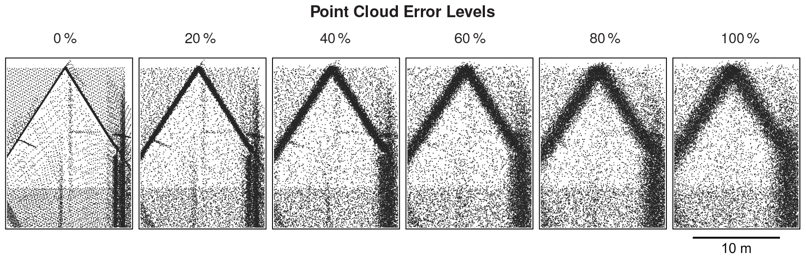
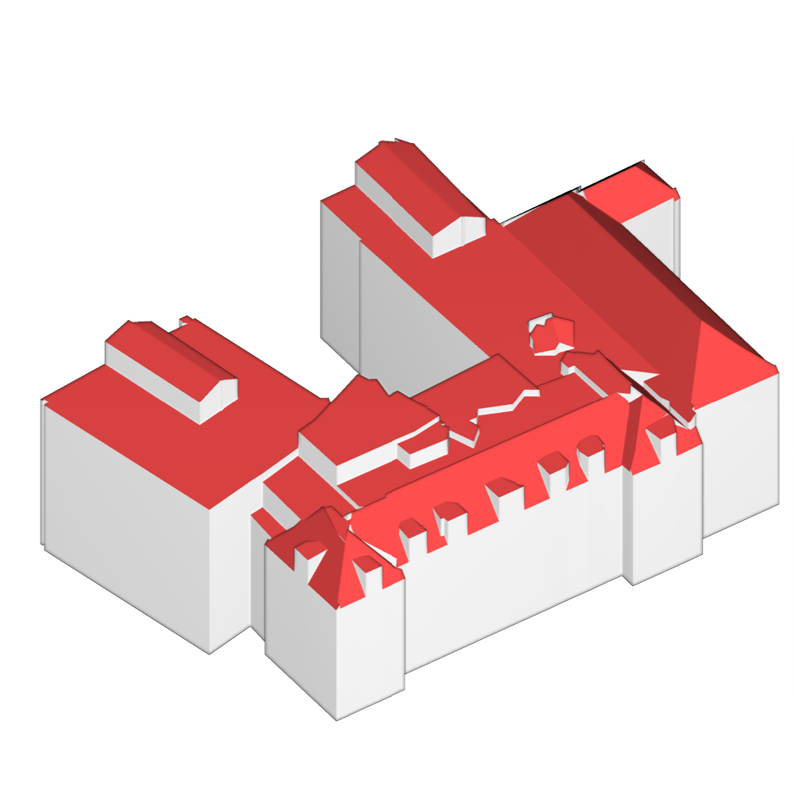
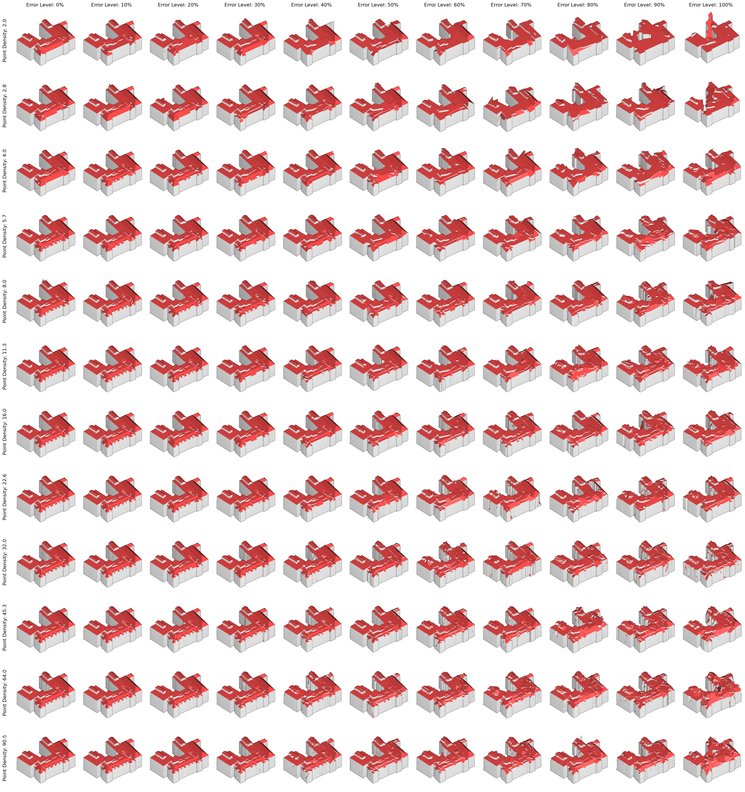

# city-to-scan-to-city

## What?

This pipeline was developed to conduct experiments that investigate how point cloud properties (e.g., density, accuracy, completeness) influence the quality of 3D building reconstruction. It served as the main tool of analysis for my master's thesis project. The final thesis on *The Impact of Point Cloud Density and Accuracy on the Quality of 3D Building Reconstruction* is available [here](resources/Master's%20Thesis%20Florian%20Faltermeier%20v1.1.pdf).

## Why?

From a technical perspective: The quality of 3D building reconstruction depends on many factors related, for instance, to the reconstruction method and the input data quality. Much work has been dedicated to the development and comparison of different reconstruction methods, but few studies have explored the significance of the input data quality. The results of this project help to close this gap. Moreover, a pipeline such as this can also provide insights that support the improvement of reconstruction methods.

From an economic point of view, the acquisition of point cloud data for the purpose of 3D building reconstruction is costly. Knowledge of the quantitative relationship of point cloud properties and reconstruction quality facilitates a well-informed survey design to optimize the latter with respect to (the acquisition cost of) the former, or to identify levels of the former to meet requirements in the latter.

## How?

The above figure illustrates the basic approach: Based on an input dataset of 3D building models, airborne laser scanning (ALS) is simulated to generate point clouds with properties varying along two dimensions. Subsequently, a new dataset of 3D building models is reconstructed from each point cloud. Each output dataset has a one-to-one correspondence between the output and the input buildings. This enables a quantitative evaluation of the reconstruction quality for each building model with respect to the reference model. Provided the dataset is sufficiently large, the evaluation can distinguish between subsets of buildings with different geometric or, if available, semantic properties.

In its current shape, the pipeline is designed to work with building models from the 3D cadastre of the Netherlands ([3DBAG](https://3dbag.nl)), but building models from any source could be used in principle. The ALS simulation is performed with [HELIOS++](https://github.com/3dgeo-heidelberg/helios). In this project, the software [Geoflow](https://github.com/geoflow3d) was used for the 3D reconstruction step, but again, any reconstruction software could be used in principle, which is one of many opportunities to extend the scope of the project and obtain further insights.

## A visual example

Following a thorough and deliberate selection process described in the thesis, a set of approximately 1100 building models from the city of Utrecht in the Netherlands was chosen as input dataset. It corresponds to the tile with ID `10-492-594` in the 3DBAG dataset.

Using HELIOS++, airborne laser scanning is simulated to obtain point clouds of the scene (including the local DTM as ground model) in $m$ different resolutions, i.e. point densities, and $n$ accuracy levels, resulting in $m \times n$ point cloud representations. After filtering and merging the point cloud strips of the individual, simulated flight passes per simulation, a resulting point cloud may look like this:

Note that the points are colored here according to the four simulated flight passes over the area. The overlap of each strip is intended to achieve complete coverage of the building roofs, avoiding areas invisible from a single trajectory, while a filtering step in the overlapping areas before merging the strips ensures a constant point density across the scene.

At the level of an individual building, the density and accuracy levels may look like this (only a subset of the simulated levels in both dimensions is shown, and accuracy levels are given as percentage of the maximum horizontal and vertical errors, which are 1 m and 0.3 m, respectively):

Next, all building models are reconstructed from each of the point clouds using Geoflow at three levels of detail: LOD 1.2, 1.3, and 2.2. Thus, for each point cloud scenario there is an output building model (actually, three models, one for each LOD) corresponding to each input building model (also available at each LOD), which can therefore be compared quantitatively using a variety of metrics.

(In a significant intermediate step, the parameters of the 3D reconstruction process are optimized for each point cloud scenario to ensure comparable 'optimality' of the reconstruction by means of Bayesian optimization using a subset of the building models and a selected quality metric. Details and reasoning in the [thesis](resources/Master's%20Thesis%20Florian%20Faltermeier%20v1.1.pdf).)

To visualize this, consider the following input building model (BAG ID `NL.IMBAG.Pand.0344100000069160`) from the input dataset:

Using the `city-to-scan-to-city` pipeline, it (together with all other models) was converted into point clouds at 12 density levels and 11 accuracy levels, resulting in 132 scenarios, and subsequently reconstructed from each point cloud. All reconstructed building models are depicted in the following image, providing a visual example of the effect of point density and accuracy on the 3D reconstruction outcome.

To quantify this effect, the evaluation module of the pipeline is capable of computing various difference metrics between the input and output building models, for instance:

- Difference in model height, surface area, and volume
- Difference in model complexity (number of triangles)
- Hausdorff distance (i.e. maximum minimum distance) and RMS minimum distance between models
- Intersection over union

 Following this, the results of these metrics are analysed both on an aggregated level across all scenarios as well as on the level of the metric distributions within and between the scenarios. For details of the evaluation, please refer to the [thesis](resources/Master's%20Thesis%20Florian%20Faltermeier%20v1.1.pdf).
